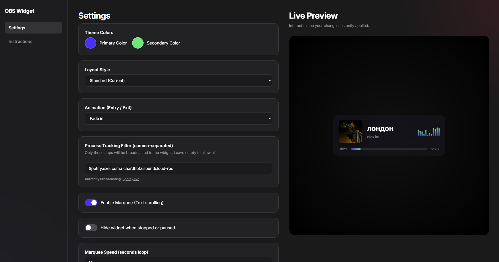
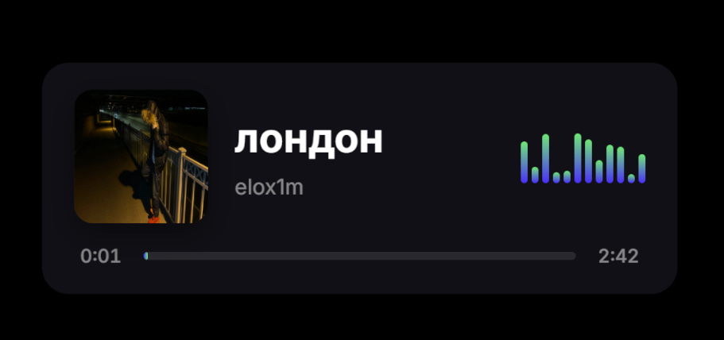

# OBS Media Widget

A professional, portable Electron-based Windows application that tracks system media metadata (System Media Transport Controls - SMTC) and broadcasts it to an OBS widget via WebSockets.



## Features

- **Real-Time Media Tracking:** Listens to Windows SMTC events to retrieve the current song's title, artist, playback status, and album thumbnail.
- **OBS Integration:** Hosts a local HTTP server and WebSocket at `localhost:8765`. Provides a ready-to-use web widget that you can import directly into OBS Studio as a Browser Source.
- **Process Filtering:** Ensure only the music you want is tracked. Whitelist specific processes (e.g., `Spotify.exe`, `chrome.exe`, `vlc.exe`).
- **Customizable Widget UI:** Customize colors, layout type (standard, compact, vertical), animations (fade, slide, zoom), and marquee text via the slick desktop dashboard.
- **System Tray Operation:** Sits quietly in the background. Access settings or quit the application via the system tray icon.
- **Optimized Performance:** Uses background worker threads for native Windows modules to prevent UI freezes and deadlocks.

## How It Works

1. The Electron main process initializes a local Express server and WebSocket server on port `8765`.
2. A separate `worker_thread` leverages `@coooookies/windows-smtc-monitor` to consistently poll audio events from whitelisted applications.
3. Media updates are instantly broadcast to any connected WebSocket client.
4. The OBS browser source connects to the WebSocket, parses the incoming data, and seamlessly updates the UI using smooth animations.

## Getting Started

### Prerequisites
- [Node.js](https://nodejs.org/) installed
- Windows OS (requires Windows 10/11 for SMTC compatibility)
- OBS Studio

### Installation

1. Clone or download the repository.
2. Install dependencies:
   ```bash
   npm install
   ```
3. Run the application in development mode:
   ```bash
   npm start
   ```

### Building for Production

To create a standalone portable `.exe`:
```bash
npm run pack
# or
npm run dist
```

## Adding to OBS Studio

1. Open OBS Studio.
2. Under "Sources", click the **+** button and select **Browser**.
3. Name it "Media Widget".
4. Set the URL to `http://localhost:8765/`.
5. Adjust width and height as needed (e.g., `500` width, `200` height).
6. Check "Refresh browser when scene becomes active".
7. Click **OK**.

## Configuration



Settings are saved automatically. The GUI settings menu lets you tweak:
- Custom Colors (Primary and Secondary hex codes)
- Process List (comma-separated executables)
- UI Animations (Fade, Slide, Zoom)
- Layout Type
- Marquee text scrolling and scroll speed

## Built With

- [Electron](https://www.electronjs.org/)
- [@coooookies/windows-smtc-monitor](https://www.npmjs.com/package/@coooookies/windows-smtc-monitor)
- [Express](https://expressjs.com/)
- [ws (WebSockets)](https://github.com/websockets/ws)
